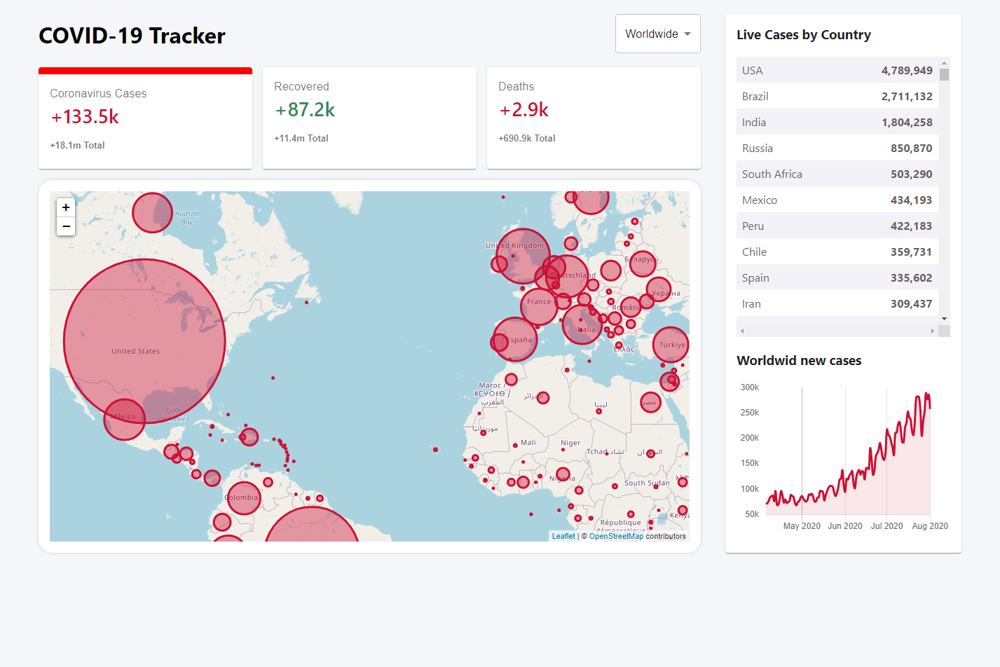

## COVID-19 Tracker

A simple COVID-19 dashboard built with React to track the daily coronavirus cases, recoveries, and deaths per country and a graph with new cases for the last 120 days.

You can select a specific country and the map will center on that country and all values will update. Clicking the circle will display the flag for that country as well as the relevant stats.

The dashboard makes use of the [Disease.sh API](https://disease.sh).

This project was bootstrapped with [Create React App](https://github.com/facebook/create-react-app).